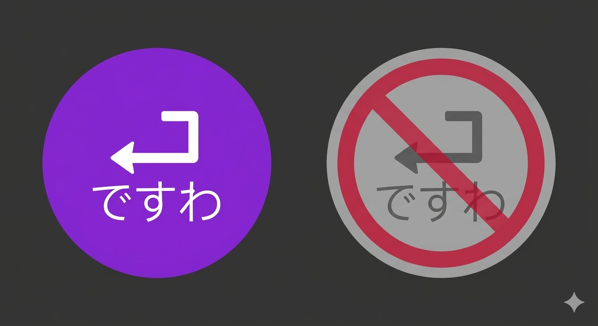

# Desuwa - ですわ

<div align="center">



**全自动口癖添加工具 - 按下回车自动发送口癖**

[](https://github.com/cneicy/Desuwa)
[](https://dotnet.microsoft.com/)
[](https://github.com/VincentZyu233/Desuwa/releases)
[](https://github.com/VincentZyu233/Desuwa/releases)

</div>

## 🚀 简介

Desuwa 是一个轻量级的 Windows 系统托盘工具，可以在你按下回车键时自动在文本末尾添加自定义口癖（如"ですわ"、"喵"、"desu"等），让你的聊天更有个性！

### ✨ 主要特性

- 🎯 **全局键盘钩子** - 监听所有应用的回车键
- 🔄 **自动文本追加** - 智能在文本末尾添加口癖
- 🎨 **自定义图标** - 启用/禁用状态使用不同的托盘图标
- ⚙️ **灵活配置** - 右键托盘图标即可编辑口癖
- 🪶 **轻量高效** - 单文件 exe，内存占用极低
- 🔇 **后台运行** - 最小化到系统托盘，不占用任务栏

## 📸 预览图片（来自上游作者

#### 起因：B站评论区


### 托盘菜单


### 演示动画


## 📥 下载安装

### 方式一：下载预编译版本（推荐）

前往 [Releases](https://github.com/VincentZyuApps/Desuwa/releases) 页面下载最新版本：

| 版本 | 说明 | 体积 | 运行时要求 |
|:---|:---|:---:|:---|
| **Self-contained** | 独立运行版 | ~140MB | 无需安装 .NET |
| **Runtime-dependent** | 运行时依赖版 | ~60KB | 需要 .NET 8.0 运行时 |

**推荐下载 Self-contained 版本**，双击即可运行，无需任何依赖。

### 方式二：从源码构建

```bash
# 克隆仓库
git clone https://github.com/VincentZyuApps/Desuwa.git
cd Desuwa

# 构建 Self-contained 版本
dotnet publish -c Release -r win-x64 --self-contained true

# 构建 Green 版本
dotnet publish -c Release -r win-x64 --self-contained false
```

## 🎮 使用方法

1. **启动程序** - 双击 `Desuwa.exe`，程序会最小化到系统托盘
2. **编辑口癖** - 右键托盘图标 → 选择"编辑口癖"
3. **启用/禁用** - 双击托盘图标或右键选择"启用/禁用"
4. **退出程序** - 右键托盘图标 → 选择"退出"

### 工作原理

- 程序监听全局键盘事件
- 检测到回车键按下时，自动跳转到文本末尾
- 在末尾追加你设置的口癖文本
- 然后发送回车键

## 🛠️ 技术栈

| 技术 | 版本 | 说明 |
|:---|:---|:---|
| [](https://dotnet.microsoft.com/) | 8.0 | 运行时框架 |
| [](https://docs.microsoft.com/en-us/dotnet/csharp/) | 12.0 | 编程语言 |
| [](https://docs.microsoft.com/en-us/dotnet/desktop/winforms/) | net8.0-windows | UI 框架 |

### 核心技术

- **全局键盘钩子** - 使用 Windows API `SetWindowsHookEx` 监听键盘事件
- **系统托盘集成** - 使用 `NotifyIcon` 实现托盘图标和菜单
- **键盘模拟** - 使用 `SendKeys` 和 `keybd_event` 模拟按键
- **自定义图标** - 嵌入资源加载 ICO 文件

## 📦 项目结构

```
Desuwa/
├── Assets/                    # 资源文件
│   ├── DesuwaLogo.png        # 原始 logo
│   ├── app.ico               # 应用程序图标
│   ├── enabled.ico           # 启用状态图标
│   ├── disabled.ico          # 禁用状态图标
│   └── generate_icons.py     # 图标生成脚本
├── .github/workflows/        # GitHub Actions CI/CD
│   ├── build.yml            # 构建工作流
│   └── build.md             # 构建文档
├── Program.cs               # 主程序
├── Desuwa.csproj           # 项目配置
└── README.md               # 本文件
```

## 🔧 开发指南

### 环境要求

- Windows 10/11
- .NET 8.0 SDK
- Visual Studio 2022 或 VS Code（可选）

### 本地开发

```bash
# 克隆仓库
git clone https://github.com/VincentZyuApps/Desuwa.git
cd Desuwa

# 还原依赖
dotnet restore

# 运行程序
dotnet run

# 构建 Release 版本
dotnet build -c Release
```

### 更新图标

如果需要更新应用图标：

```bash
cd Assets

# 安装 Python 依赖
pip install Pillow

# 运行图标生成脚本
python generate_icons.py

# 提交生成的 ICO 文件
git add *.ico
git commit -m "chore: update icons"
```

## 🤝 贡献

欢迎提交 Issue 和 Pull Request！

## 📝 更新日志

查看 [Releases](https://github.com/VincentZyuApps/Desuwa/releases) 页面了解 下游仓库版本的更新历史。

## 🙏 致谢

- Logo 由 [Nano Banana](https://nanobana.ai/) 生成

---

<div align="center">

**[⬆ 回到顶部](#desuwa---ですわ)**

Made with ❤️ by [VincentZyu](https://github.com/VincentZyuApps)

</div>
